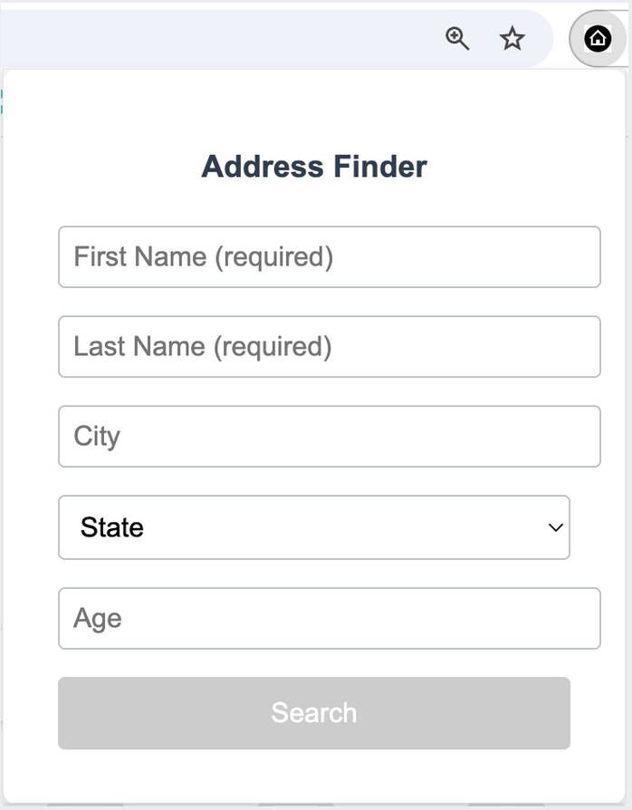
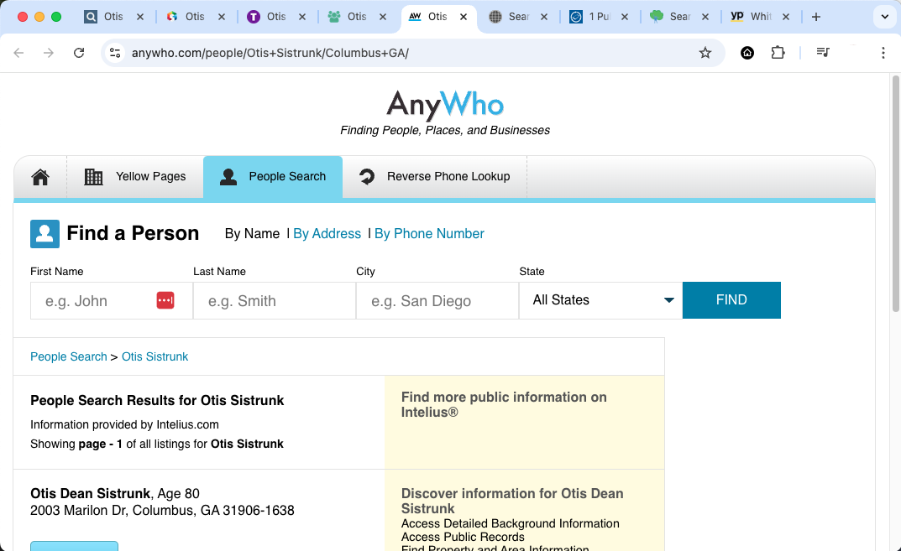

# AddressFinderExtension

This is a [chrome extension](https://developer.chrome.com/docs/extensions/develop) that can add functionality to your Chrome Browser. The [chrome developer get started page](https://developer.chrome.com/docs/extensions/get-started) has useful background and examples.

## Description

Chrome extension that allows user to initiate searches for a person's address on the following sites in one action:

 - [anywho.com](https://www.anywho.com)
 - [familytreenow.com](https://www.familytreenow.com)
 - [fastpeoplesearch.com](https://www.fastpeoplesearch.com)
 - [searchpeoplefree.com](https://www.searchpeoplefree.com)
 - [smartbackgroundchecks.com](https://www.smartbackgroundchecks.com)
 - [thatsthem.com](https://thatsthem.com)
 - [truepeoplesearch.com](https://www.truepeoplesearch.com)
 - [usphonebook.com](https://www.usphonebook.com)
 - [yellowpages.com](https://people.yellowpages.com/whitepages)

## Usage

In the browser's toolbar, click on the  icon and thesearch form will appear:

Enter the person's first name and last name. The city and state fields are highly recommended if you know the information. 

Click the `Search` button and the extension will open a new tab for each of the sites listed above with the search results for the person you entered:

 

## Set Up

**Install**

 1. Clone this repo locally to your computer
 2. In your Chrome browser, navigate to this url: **[chrome://extensions/](chrome://extensions/)**

You will see a page like this:

 

 3. Click the `Load unpacked` button and choose the directory where you downloaded the repo
 4. You will see an entry for `Address Finder Extension 1.0` as shown in the screen above. 

**Enabling the extension**

 

1. Click on the puzzle icon in the browser toolbar (as shown in the screen above)
2. Click on the pin next to `Address Finder Extension`
3. You should now see the  icon in the toolbar next to the puzzle icon
